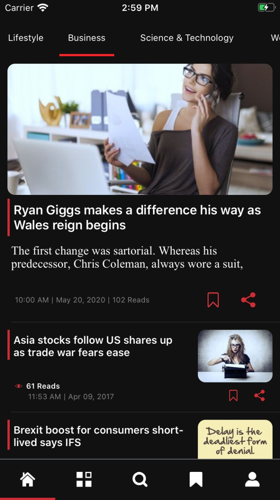
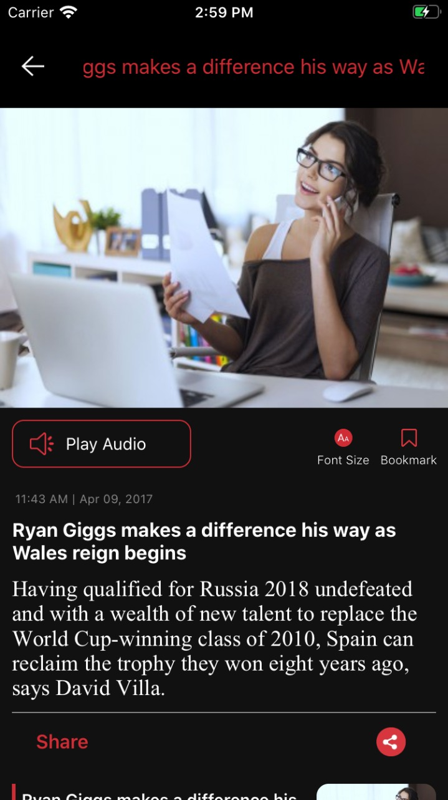
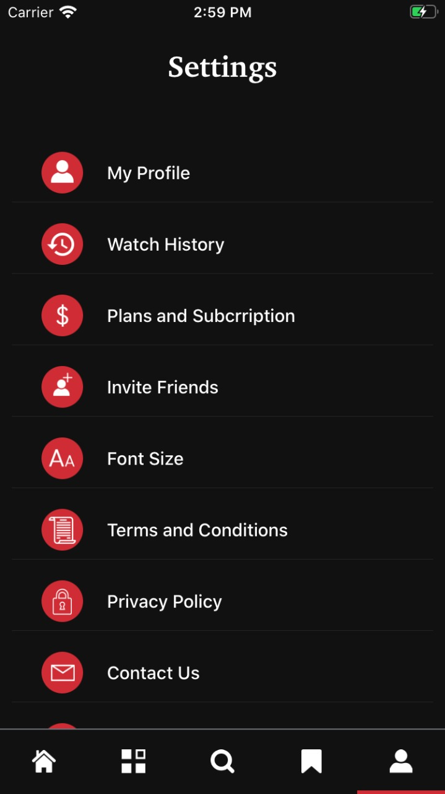
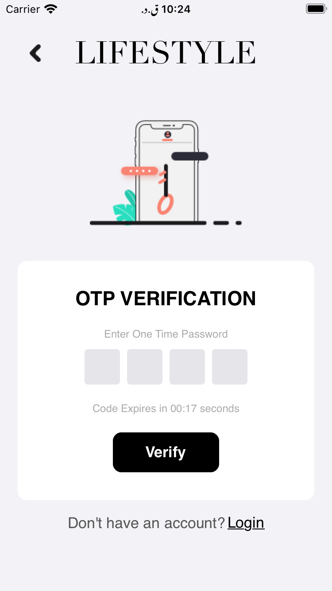
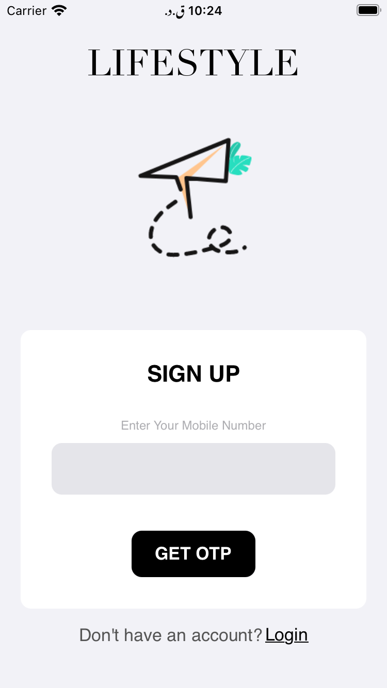
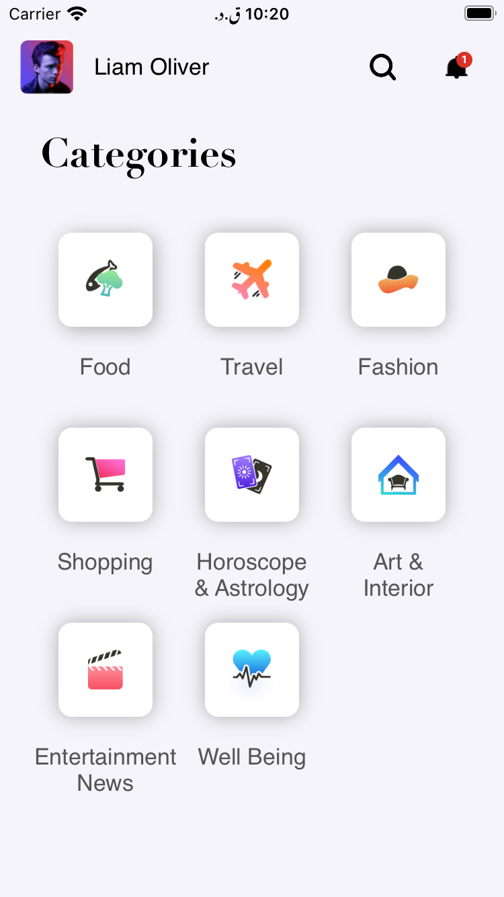

# Portfolio

    
Hy, I'm an iOS Developer for <strong>more than 1yr</strong>. Developed native iOS apps ranging from simple education apps to high-end secure enterprise apps. Always working towards clean code, intuitive user experience, data security. I am striving to keep up with new technologies. 
      
      # Hello Doctor (Digital Healthcare Service)
[HelloDoctor](https://apps.apple.com/us/app/hello-doctor-patient/id1502356693?ls=1) is a online Doctor's App. The basic requirements for the app were that it help address the health related problem by providing reliable online health platform which connects the Certified and Authorised Doctor’s to the Clients / Patients face to face on video / chat / audio calling.

HelloDoctor was built entirely in Swift, with no external dependencies, and the UI
        —which was created using Auto Layout in Interface Builder
        —is attractive and animates smoothly. Most importantly, the code is clean, easy to reason about, and maintains strong separation of concerns.

&nbsp;&nbsp;&nbsp;&nbsp;&nbsp;&nbsp;&nbsp;&nbsp;&nbsp;&nbsp;&nbsp;&nbsp;&nbsp;&nbsp;&nbsp;&nbsp;

  
  
    # Deikho - Video on demand service App
[Deikho]() App is a Video on demand service App where you can watch video online on ios device <b>Under Developement </b>

&nbsp;&nbsp;&nbsp;&nbsp;&nbsp;&nbsp;&nbsp;&nbsp;&nbsp;&nbsp;&nbsp;&nbsp;&nbsp;&nbsp;&nbsp;&nbsp;

<b>Under Testing</b>

     # Mobile NewsPaper App
[Mobile Akhbar]() App will provide users to read online newspaper.

&nbsp;&nbsp;&nbsp;&nbsp;&nbsp;&nbsp;&nbsp;&nbsp;&nbsp;&nbsp;&nbsp;&nbsp;&nbsp;&nbsp;&nbsp;&nbsp;

    
     # Lifestyle
 [Lifestyle]() is an online Telenors app that helps you have a more balanced and healthy lifestyle. It shows users nutritional details in food products to fit their unique lifestyle.

&nbsp;&nbsp;&nbsp;&nbsp;&nbsp;&nbsp;&nbsp;&nbsp;&nbsp;&nbsp;&nbsp;&nbsp;&nbsp;&nbsp;&nbsp;&nbsp;

<b>Under Testing</b>
