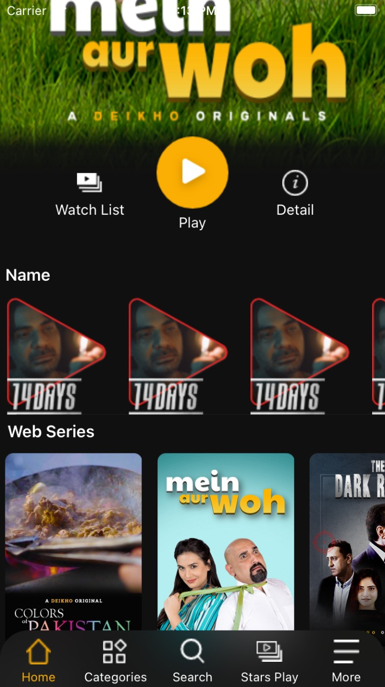
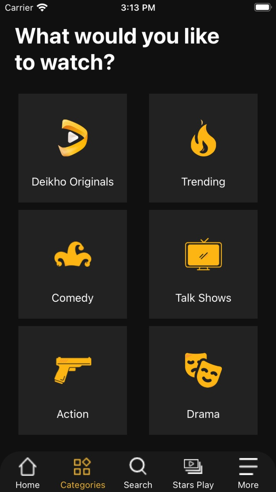
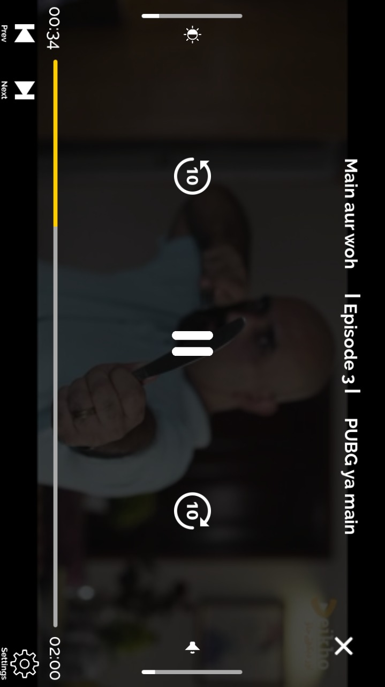

# Portfolio

    
Software Engineer as an iOS Developer for <strong>more than 1yrs</strong>. Developed native iOS apps ranging from simple education apps to high-end secure enterprise apps. Always working towards clean code, intuitive user experience, data security. I am striving to keep me up with new technologies. 
      
      # Hello Doctor (Digital Healthcare Service)
[HelloDoctor](https://apps.apple.com/us/app/hello-doctor-patient/id1502356693?ls=1) is a online Doctor's App. The basic requirements for the app were that it help address the health related problem by providing reliable online health platform which connects the Certified and Authorised Doctor’s to the Clients / Patients face to face on video / chat / audio calling.

I'm quite happy with the final product: HelloDoctor was built entirely in Swift, with no external dependencies, and the UI—which was created using Auto Layout in Interface Builder—is attractive and animates smoothly. Most importantly, the code is clean, easy to reason about, and maintains strong separation of concerns.

&nbsp;&nbsp;&nbsp;&nbsp;&nbsp;&nbsp;&nbsp;&nbsp;&nbsp;&nbsp;&nbsp;&nbsp;&nbsp;&nbsp;&nbsp;&nbsp;

  
  
    # Deikho - Video on demand servic App
[Deikho]() App is a Video on demand servic App where you can see video online on ios device <b>Under Developement </b>

&nbsp;&nbsp;&nbsp;&nbsp;&nbsp;&nbsp;&nbsp;&nbsp;&nbsp;&nbsp;&nbsp;&nbsp;&nbsp;&nbsp;&nbsp;&nbsp;

<b>Under Testing</b>
